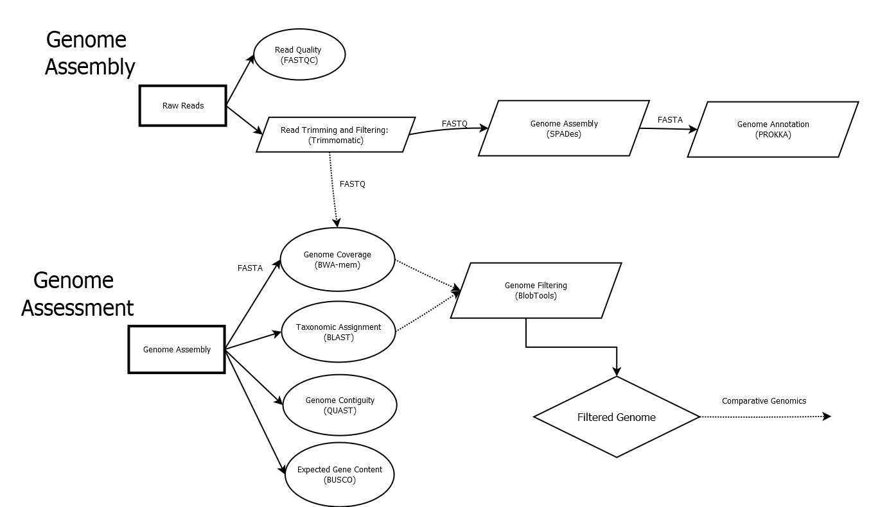
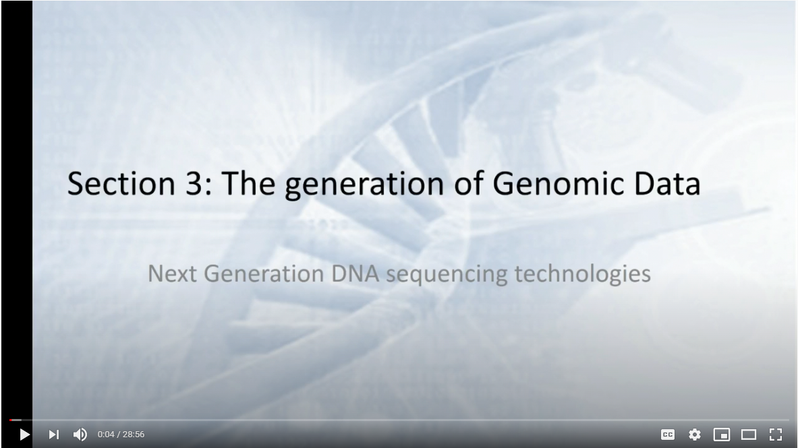
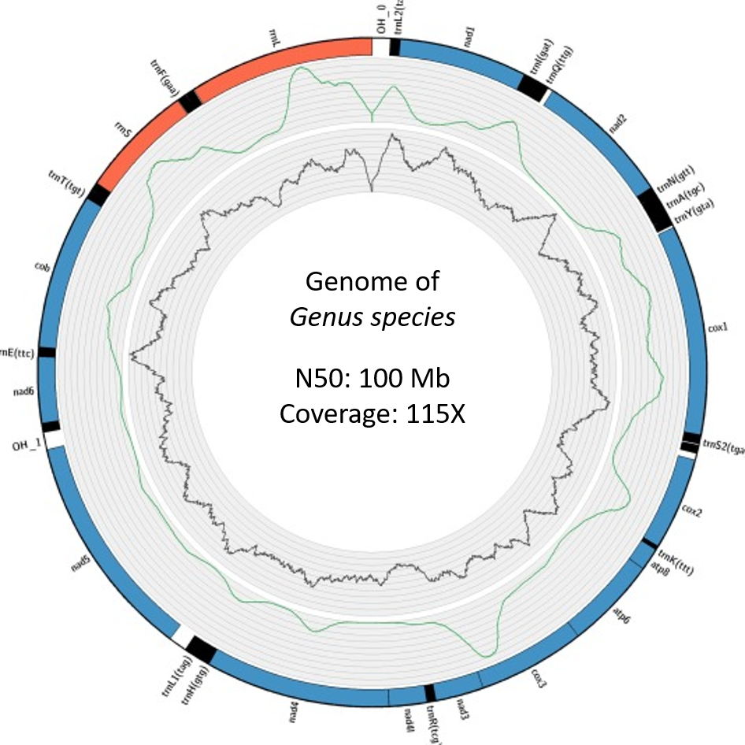

# MDIBL-T3-WGS-Tutorial
Whole-Genome Assembly and Assessment Tutorial

## Overview of the Workflow



## Table of Contents

* [Getting Started](https://github.com/Joseph7e/MDIBL-T3-WGS-Tutorial#general-notes)  
    * [Joe's BASH Tutorials](https://github.com/Joseph7e/HCGS-BASH-tutorial) and [INBRE BASH Tutorials](https://geiselmed.dartmouth.edu/nhinbre/bioinformatics-modules/)
    * [Reproducibility](https://github.com/ToniWestbrook/repeatfs)
    * [Starting Data](https://github.com/Joseph7e/MDIBL-T3-WGS-Tutorial#starting-data) 
* [Assessment of Sequencing Reads](https://github.com/Joseph7e/MDIBL-T3-WGS-Tutorial#sequencing-read-assessment)
    * [FASTQ file format](https://github.com/Joseph7e/MDIBL-T3-WGS-Tutorial#fastq-file-format)
    * [Read Quality Check](https://github.com/Joseph7e/MDIBL-T3-WGS-Tutorial#examine-read-quality) - w/FASTQC
* [Adapter and Quality Trimming](https://github.com/Joseph7e/MDIBL-T3-WGS-Tutorial#adapter-and-quality-trimming) - w/Trimmomatic
* [Genome Assembly](https://github.com/Joseph7e/MDIBL-T3-WGS-Tutorial#genome-assembly) - w/SPAdes
    * [FASTA file format](https://github.com/Joseph7e/MDIBL-T3-WGS-Tutorial#fasta-format)
* [Genome Assessment](https://github.com/Joseph7e/MDIBL-T3-WGS-Tutorial#genome-assessment)
    * [Genome Structure (Contiguity)](https://github.com/Joseph7e/MDIBL-T3-WGS-Tutorial#genome-structure-assessment) - w/ QUAST
    * [Expected Gene Content](https://github.com/Joseph7e/MDIBL-T3-WGS-Tutorial#genome-content-assessment) - w/ BUSCO
* [Genome Annotation](https://github.com/Joseph7e/MDIBL-T3-WGS-Tutorial#genome-annotation) w/PROKKA
* [Identification of the Organism](https://github.com/Joseph7e/MDIBL-T3-WGS-Tutorial#organism-identification)
    * [BLAST](https://github.com/Joseph7e/MDIBL-T3-WGS-Tutorial#blast)
* [Read Mapping](https://github.com/Joseph7e/MDIBL-T3-WGS-Tutorial#read-mapping) w/BWA and Samtools
* [Filtering the Genome Assembly](https://github.com/Joseph7e/MDIBL-T3-WGS-Tutorial#non-target-contig-removal) w/Blobtools
* [What's Next?](https://github.com/Joseph7e/MDIBL-T3-WGS-Tutorial#afterthoughts)
    * [Genome Visualization](https://github.com/Joseph7e/MDIBL-T3-WGS-Tutorial#genome-visualization)
    * [Submission to NCBI](https://github.com/Joseph7e/MDIBL-T3-WGS-Tutorial)
    * [Comparative Genomics](https://github.com/Joseph7e/HCGS-Comparative-Genomics)
 
## General Notes:
**For each program that we run in this tutorial I have provided a link to the manual**. These manuals provide a thorough explanation of what exactly we are doing. Before running the program it is a good idea to skim through these, examine the options, and see what it does. It is also a good idea to check out the publication associated with the program. Please note that the commands we run are general and usually executed with default settings. This works great for most genomes but the options may need to be tweaked depending on your genome. Before you run any command it is also a great idea to look at the programs help menu. This can usually be done with the name of the program followed by '-h' or '-help' or '--help'. i.e. 'spades -h'. Also ... never forget about google for quick answers to any confusion.


Throughout this tutorial the commands you will type are formatted into the gray text boxes (don't do it when learning but they can be faithfully copied and pasted). The '#' symbol indicates a comment, BASH knows to ignore these lines. 


This tutorial assumes a general understanding of the BASH environment. **You should be familiar with moving around the directories and understand how to manipulate files**.

See the BASH tutorial and primers to get started. https://github.com/Joseph7e/HCGS-BASH-tutorial

**Remember to tab complete!** There is a reason the tab is my favorite key. It prevents spelling errors and allows you to work much faster. Remember if a filename isn't auto-completing you can hit tab twice to see your files while you continue typing your command. If a file doesn't auto-complete it means you either have a spelling mistake, are in a different directory than you originally thought, or that it doesn't exist.


## Starting Data:

Isolate Bacteria            |  Extract DNA
:-------------------------:|:-------------------------:
  |  


Prepare Library           |  Sequence DNA
:-------------------------:|:-------------------------:
  |  

## How NGS sequencing works
[](https://www.youtube.com/watch?v=t0FMT_zxMrs "Sequencing")


<iframe width="560" height="315" src="https://www.youtube.com/embed/t0FMT_zxMrs" title="YouTube video player" frameborder="0" allow="accelerometer; autoplay; clipboard-write; encrypted-media; gyroscope; picture-in-picture" allowfullscreen></iframe>


Your starting data is found within a shared directory within your group folder (one directory level up). To start we will move a set of Sample data into your home directories. Each of these samples represent the genome of a unique and novel microbe that has not been seen before (except by me). Inside this directory are Illumina HiSeq 2500, paired-end, 250 bp sequencing reads. Looking in this directory you should see two files per sample, the forward and reverse reads. These files are in **FASTQ** format (see below).


## Get your bearing on the server.

It's hard to know where your going if you don't know where you are. When I am working on the server I constantly type 'ls' and 'pwd' to make sure I am where I think I am. You should too!

```bash
# print your current working directory. If you just logged in you should be in your home directory (/home/group/username/)
pwd
# change to your home directory in case you weren't already there. Remember ~/ is an absolute path to your home directory.
cd ~/
# ls to view your home dir
ls
# ls to view the group directory (I type ‘ls’ a lot!)
ls ../
# view the shared directory of starting data
ls ../shared
# View the shared project with the ‘tree’ command
tree ../shared
# Copy a sample from the shared directory to your home dir, 
#“Project_X”, where X denotes the Project name and "Sample_X" (where X denotes your sample name).
# USE AUTOCOMPLETE
cp -r ../shared/Project_X/ Sample_X/ ./
# confirm the copy arrived (remember ‘*’ will match any character/string)
ls Sample_*/
```

[Link explaining the 'Read Name Format'](http://support.illumina.com/content/dam/illumina-support/help/BaseSpaceHelp_v2/Content/Vault/Informatics/Sequencing_Analysis/BS/swSEQ_mBS_FASTQFiles.htm): SampleName_Barcode_LaneNumber_001.fastq.gz


Important note: In the above command I use the "\*" character to view the Sample directory, I would normally just type out the entire path using tab complete (which is what you should do). This wildcard will match any string of characters. I use this because everyone will have a different Sample name. To make this tutorial as general as possible I need to use these wildcards throughout the tutorial. In addition I may use Sample_X instead of Sample_\*. In these cases be sure to type out your complete sample name!, the wildcards probably won't work 


* Prepare your working directory

It is a good idea to keep your directories tidy and to name your files something that makes sense. This is just to keep things organized so you know what everything is several months from now. We are going to make a new directory to house all of the analyses for this tutorial.

```bash
# Make a new directory and add the Sample directory into it
mkdir mdibl-t3-2019-WGS
mv Sample* mdibl-t3-20189-WGS/
cd mdibl-t3-2019-WGS/
# make the sample directory name more meaningful
mv Sample_X Sample_X-raw_reads
```

## Sequencing Read Assessment

Note the file extension - fastq.**gz**. Since these files are usually pretty big it is standard to receive them compressed. To view these files ourselves (which you normally wouldn't do) you either have to decompress the data with gzip or by using variations of the typical commands. Instead of 'cat' we use 'zcat', instead of grep we can use 'zgrep'. Below I show both ways.
       
```bash
# Examine the reads with zcat, I use the wildcard '*' to match the file since everyone's names will be different. Use tab complete and there is no need for the wildcards.
zcat Sample*/*_R1_* | more
# unzip the data and view
gunzip Sample*/*_R1_*
more Sample*/*_R1_*
# rezip the data
gzip Sample*/*_R1_*
# Examine reads directly with less
less -S Sample*/*_R1_*
```

#### Fastq File Format
Each sequencing read entry is four lines long.. 

    - Line 1. Always begins with an '@' symbol and denotes the header. This is unique to each sequence and has info about the sequencing run. 

    - Line 2. The actual sequencing read for your organism, a 250 bp string of As, Ts, Cs, and Gs.

    - Line 3. Begins with a '+' symbol, this is the header for the read quality. Usually the same as the first line header. 

    - Line 4. Next are ascii symbols representing the quality score (see table below) for each base in your sequence. This denotes how confident we are in the base call for each respective nucleotide. This line is the same length as the sequencing line since we have a quality score for each and every base of the sequence. 


* Count The Number of Raw Reads

I always start by counting the number of reads I have for each sample. This is done to quickly assess whether we have enough data to assemble a meaningful genome. Usually these file contains millions of reads, good thing BASH is great for parsing large files! Note that the forward and reverse reads will have the same number of entries so you only need to count one.

```bash
# using grep. Note that I don't count just '@', this is because that symbol may appear in the quality lines.
zgrep -c '@HSQ' Sample*/*R1*
# counting the lines and dividing by 4. Remember each read entry is exactly four lines long. These numbers should match.
zcat Sample*/*_R1_* | wc -l
```
* Whats our total bp of data? This is what we call our sequencing throughput. We multiple the number of reads by the read length (ours is 250) and by 2 because it is paired-end data.

(Read length x 2(paired-end) x Number of reads)

```
# we can do this calculation from the terminal with echo and bc (bc is the terminal calculator)
echo "Number_of_reads * 250 * 2" | bc
```

* If we have a 7 MB genome, what is our average coverage? 

(Total bp/7,000,000)
```
echo "Total_bps / 7000000" | bc
```

If you completed the above calculation lets hope you have at least 10X coverage. For the most part, the higher the coverage the better off we are. If you have low coverage you'll want to do some more sequencing and get more read data. Usually published genomes have at least 70-100X coverage.

## Examine Read Quality
program: FASTQC  
manual: https://www.bioinformatics.babraham.ac.uk/projects/fastqc/

[FASTQC explained](http://www.bioinformatics.babraham.ac.uk/projects/fastqc/Help/3%20Analysis%20Modules/)

* Run Fastqc

FastQC is a program to summarize read qualities and base composition. Since we have millions of reads there is no practical way to do this by hand. We call the program to parse through the fastq files and do the hard work for us. **The input to the program is one or more fastq file(s) and the output is an html file with several figures.** The link above describes what each of the output figures are describing. I mainly focus on the first graph which visualizes our average read qualities and the last figure which shows the adapter content. Note that this program does not do anything to your data, as with the majority of the assessment tools, it merely reads it.

```bash
# make a directory to store the output
mkdir fastqc_raw-reads
# run the program
fastqc Sample_*/*_R1_* Sample_*/*_R2_* -o fastqc_raw-reads
ls fastqc_raw-reads
# the resulting folder should contain a zipped archive and an html file, we can ignore the zipped archive which is redundant.
```

* Transfer resulting HTML files to computer using filezilla or with the command line on OSX/Linux.

On filezilla you will need to enter the same server information when you login form the terminal. Be sure to use port 22.  

```bash
# to get the absolute path to a file you can use the ‘readlink’ command.
readlink -f fastqc_raw-reads/*.html
# copy those paths, we will use them for the file transfer
# In a fresh terminal on OSX, Linux, or BASH for windows
scp USERNAME@ron.sr.unh.edu:/home/GROUP/USERNAME/mdibl-t3-2019-WGS/fastqc_raw-reads/*.html /path/to/put/files
```

* Transfer resulting HTML files to computer using filezilla or with the command line on OSX/Linux.

On filezilla you will need to enter the same server information when you login form the terminal. Be sure to use port 22.  

```bash
# to get the absolute path to a file you can use the ‘readlink’ command.
readlink -f fastqc_raw-reads/*.html
# copy those paths, we will use them for the file transfer
# In a fresh terminal on OSX, Linux, or BASH for windows
scp USERNAME@ron.sr.unh.edu:/home/GROUP/USERNAME/mdibl-t3-2019-WGS/fastqc_raw-reads/*.html /path/to/put/files
```

## Adapter and Quality Trimming
Trimmomatic
manual: http://www.usadellab.org/cms/uploads/supplementary/Trimmomatic/TrimmomaticManual_V0.32.pdf

alternative tools: [cutadapt](http://cutadapt.readthedocs.io/en/stable/guide.html), [skewer](https://github.com/relipmoc/skewer)

* Run Trimmomatic

You may have noticed from the fastqc output the some of your reads have poor qualities towards the end of the sequence, this is especially true for the reverse reads and is common for Illumina data. You may also notice that the fastqc report 'failed' for adapter content. The Trimmomtic program will be used to trim these low quality bases and to remove the adapters. I created a wrapper script called trim_script_TruSeq.sh which makes this program much easier to use. It is available on the server by calling its name, it is also available on this github repository. For this wrapper script **the input is the raw forward and reverse reads and the output will be new trimmed fastq files**. We will use these trimmed reads for our genome assembly. When you are more comfortable using BASH you can call Trimmomatic directly by using the manual or by copying the code from the provided script.

```bash
# Run wrapper script
trim_script_TruSeq.sh Sample_*/*_R1_* Sample_*/*_R2_*
# if you want to see inside the program you can take a look.
which trim_script_TruSeq.sh
more /usr/local/bin/trim_script_TruSeq.sh
```

* Move the trimmed reads to new directory - remember its a good idea to keep the directory clean.
```bash
mkdir trimmed_reads
# move all the reads into the new directory
mv *fastq.gz trimmed_reads/
# confirm that the files have moved
ls trimmed_reads/
```

When the program finishes it outputs four files. paired_forward.fastq.gz, paired_reverse.fastq.gz, and two unpaired reads. These output files are cleaned reads, which hopefully retained the highly confident sequences and have removed the adapters from the sequences. Some sequences will be lost entirely, some will lose a few bases off the ends, and some won't be trimmed at all. When a reverse read is lost but a forward read is maintained, the forward read will be written to the unpaired_forward.fastq.gz file (and vise-versa).


Similar to above, you can run FASTQC again with your new trimmed reads. Comparing the original html and the new one you should note the differences (see above).

You can also count the number of reads for each of your files like you did for the raw reads. How does this compare to the original count? What percentage of your reads did you lose? How many reads are unpaired?

## Genome Assembly


program: SPAdes
manual: http://cab.spbu.ru/software/spades/

alternative tools: [ABySS](http://www.bcgsc.ca/platform/bioinfo/software/abyss), [MaSuRCA](http://masurca.blogspot.com/)

With our trimmed reads in hand are now ready to assemble our genomes (check out Kelley's PowerPount for how it works). There are many programs that are used for genome assembly and different assemblers work well with certain genomes (how large the genome is, how complex, is it a Eukaryote, etc), but SPAdes works very well for most bacteria. Either way these programs are usually run with the same sort of syntax. **The input is a set of sequencing reads in FASTQ format and the output will be a FASTA file which is the genome assembly**. I encourage you to try out a different assembler and compare the results.

* Run SPAdes
```bash
# examine the help menu
spades.py --help
# run spades with the forward, reverse, and unpaired reads.
nohup spades.py -1 trimmed_reads/paired_forward.fastq.gz -2 trimmed_reads/paired_reverse.fastq.gz -s trimmed_reads/unpaired_forward.fastq.gz -s trimmed_reads/unpaired_reverse.fastq.gz -o spades_assembly_default -t 24 &
```

Notice that the above command makes use of 'nohup' and '&'. Its good practice to always use these two together. This allows you to close your computer and let the server continue working and/or let you continue working while the job runs in the background. This is the most computationally expensive program of the pipeline. It is taking our millions of reads and attempting to put them back together, as you can image that takes a lot of work. It will probably take a few hours to run.

You can check the output of nohup for any errors. If there are any errors you will see them at the bottom of the file. The best way to check is with the 'tail' command. Try 'tail nohup.out'.

* Check the status of your job w/ 'top' -- [top explanation](https://www.booleanworld.com/guide-linux-top-command/)
```bash
# 'top' lets you see all the jobs that are running on the server
top
# adding the user option lets you view just your jobs
top -u $USER
# the "$USER" variable always links to your user name, to see what I mean echo it.
echo $USER
```

* View Output Data When the assembly finishes.

```bash
ls spades_assembly_default/
# view FASTA file
less -S spades_assembly_default/contigs.fasta
# view the top 10 headers
grep '>' spades_assembly_default/contigs.fasta | head
# count the number of sequences
grep -c '>' spades_assembly_default/contigs.fasta
```

## FASTA format

The FASTA format is similar to the FASTQ format except it does not include quality information. Each sequence is also delineated by a '>' symbol instead of a '@'. In addition, all the sequences will be much larger (since they were assembled). Instead of all the sequencing being 250 bp they could be the size of an entire genome!  Each of the sequence entries in the FASTA file are typically refereed to as a contig, which means contiguous sequence. 


In an ideal world the assembler would work perfectly and we would have one contig per chromosome in the genome. In the case of a typical bacterium (if there is such a thing) this would mean one circular chromosome and maybe a plasmid. So if the assembly worked perfect we would see two contigs in our FASTA file. However, this is very rarely the case (unless we add some sort of long-read technology like pacbio or nanopore sequencing). 


How fragmented your reconstructed genome is usually depends on how many reads you put into your assembler, how large the genome is, and what the architecture and complexity of the genome is like. We typically see a genome split into 10's to 100's of contigs for a typical run.

In the case of SPAdes the FASTA headers are named in a common format. Something like "NODE_1_length_263127_cov_73.826513". The first field is a unique name for the contig (just a numerical value), the next field is the length of the sequence, and the last field is the kmer coverage of that contig (this is different than read coverage which NCBI submissions require). Furthermore, the contigs are organized by length where the longest contigs are first.


* Clean up Spades directory.

When you listed the SPAdes directory you could see that it makes a lot of output folders, all of which are explained in the manual. We really only 'care' about the contigs.fasta file and the spades.log. The spades.log is important because it includes details about how exactly we ran the assembly. If you ever wanted to reproduce your assembly this file might come in handy. The rest of the files can be deleted, if we ever need them you can always use the spades.log to rerun the analysis.

We are going to proceed to remove these unwanted files. **Remember if you delete a file using the 'rm' command it is gone forever, there is no way to get it back, there is no recover from trash bin, so be careful!**


```bash
# There are many ways to do this, proceed however you are comfortable. I am going to move the files I want to keep out of the directory, delete everything else in the directory with 'rm' then move my files back in. Alternatively you could just remove unwanted files one at a time.
# Move into the spades directory
cd spades_spades_assembly_default/
# move the files we want to keep back one directory
mv contigs.fasta spades.log ../
# confirm that the files moved!!!!!!!
ls ../
# confirm you are still in the spades_directory (I'm paranoid)
pwd
# you should see something like /home/GROUP/UserName/mdibl-t3-2018-WGS/spades_directory_default/
# After you confirm the files have been moved and you are in the right directory, delete the unwanted files
rm -r *
# move the files back
mv ../contigs.fasta ../spades.log ./
# list the directory and you should see just the two files.
ls
```

# Genome Assessment

Now that are initial spades assembly is completed we can move on to genome assessment. We will use QUAST to examine contiguity, BUSCO to assess completeness, and blobtools to check for contamination.


We are also going to use BLAST to identify our organisms. Up to this point you probably don't know what it is.


## Genome Structure Assessment
program: QUAST
manual: http://quast.bioinf.spbau.ru/manual.html

QUAST is a genome assembly assessment tool to look at the contiguity of a genome assembly, how well the genome was reconstructed. Did you get one contig representing your entire genome? Or did you get thousands of contigs representing a highly fragmented genome? Quast also gives us some useful information like how many base pairs our genome assembly is (total genome size).

QUAST has many functionalities which we will explore later on in the tutorial, for now we are going to use it in its simplest form. It essentially just keeps track of the length of each contig and provides basic statistics. This type of information is something you would typically provide in a publication or to assess different assemblers/options you may use. **The input to the program is the genome assembly FASTA and the output are various tables and a html/pdf you can export and view.**

* Run Quast
```bash
# look at the usage
quast.py --help
# run the command
quast.py contigs.fasta -o quast_results
```
* View output files

Most of the output files from QUAST contain the same information in different formats (tsv, txt, csv etc). Open up any of these files to see the output. Descriptions for each metric can be seen below. You can use the total assembly size in the coverage estimate from above.


## Genome Content Assessment w/ BUSCO
manual: https://busco.ezlab.org/


BUSCO is a program utilized to assess the completeness of a genome assembly. This program makes use of the OrthoDB set of single-copy orthologous that are found in at least 90% of all the organisms in question. There are different data sets for various taxonomic groups (Eukaryotes, Metazoa, Bacteria, Gammaproteobacteria, etc. etc.). The idea is that a newly sequenced genome should contain most of these highly conserved genes. If your genome doesn't contain a large portion of these single-copy orthologs it may indicate that your genome is not complete.


* BUSCO preperation
```bash
# Busco requires a path variable to be set before use.
echo export AUGUSTUS_CONFIG_PATH="/usr/local/src/augustus-3.2.2/config/" >> ~/.bashrc
# resource your bashrc to let the change take affect. (google bashrc to see what it is)
source ~/.bashrc
```
* Path to lineage data on RON:

We will be using the Bacterial data set for our BUSCO analyis. However, there are many data sets available on our server. Listing the path below will show you all the available data sets. These can also be seen in the BUSCO manual linked above. 

```bash
# View available sets
ls /usr/local/src/augustus-3.2.2/rc/
```
* Run BUSCO

**The input to the program is your genome assembly (contigs) as well as a selection of which database to use. The output is a directory with a short summary of the results, a full table with coordinates for each orthologous gene is located in your assembly, and a directory with the nucleotide and amino acid sequences of all the identified sequences.**

```bash
#look at the help menu
run_BUSCO.py --help
# run busco
nohup run_BUSCO.py -i contigs.fasta -o busco_output -m genome -l /usr/local/src/augustus-3.2.2/lineages/bacteria_odb9/ -c 1 &
# note: the -c command is the number of threads. A bug in BLAST prevents consistent results with greater than 1 for this option.
```

* Examine the BUSCO output.

The first file we will look at is the 'short_summary_busco_output.txt'. This is a file which summarizes the main findings, how many of the expected genes did we find? This summary breaks the report into four main categories: complete single-copy genes, complete duplicated genes, fragmented genes, and missing genes. We are hopeful that the majority of our genes will be found as 'complete single-copy'. Duplicated genes could indicate that that particular gene underwent a gene duplication event or that we had a miss assembly and essentially have two copies of a region of our genome. Fragmented genes are an artifact of the fact that our genome did not assemble perfectly. Some of our genome is fragmented into multiple contigs, and with that some of our genes are going to be fragmented as well. This is why it is important to inspect the N50 of the genome with QUAST. We want the majority of our contigs to be at least as big as a gene, if it's not than we will have many fragmented genes as a result.

Next we will view the 'full_table_busco_output.tsv' file. This is a file which shows the coordinates for all the associated single copy genes in our genome. It also provides information about the status of that ortholog (missing, complete, fragmented). This tsv file can be exported and viewed in excel.

The final files we will examine are in a directory called 'single_copy_busco_sequences/'. This houses all the amino acid and protein sequences. This is a rich source for comparative genomics and other sorts of analyses.

```bash
# view the short summary
less -S run_busco_output/short_summary_busco_output.txt
# view the full table
less -S run_busco_output/full_table_busco_output.tsv
# list and view a amino acid of protein sequence
ls run_busco_output/single_copy_busco_sequences/
```

## Genome Annotation
program: PROKKA
manual: https://github.com/tseemann/prokka

alternative tools: [NCBI PGA](https://www.ncbi.nlm.nih.gov/genbank/genomesubmit_annotation/), [Glimmer](https://ccb.jhu.edu/software/glimmer/)


PROKKA does a lot, and is documented very well, so i will point you towards the course website and manual for more detailed information. It is a "rapid prokaryote genome annotation pipeline". Some of the relevant options include what genetic code your organism uses (standard is default), and what types of sequences you want to annotate (tRNA, rRNA, CDS).

* Run PROKKA

 **The input to the program is your contig FASTA file, the output is gene annotations in GFF (and other) formats, as well as FFN (nucleotide) and FAA (amino acid) FASTA sequence files for all the annotated sequences.** We will be using several of these files to investigate the genome content of our genome. What genes does it have? What do these gene code for?
 
```bash
# look at the help menu.
prokka --help
# run the script, specifying an output directory
nohup prokka contigs.fasta --outdir prokka_output --cpus 24 --mincontiglen 200 &
```

* PROKKA Output


```bash
# list all the output files.
ls prokka_output
# The GFF file contains the all the annotations and coordinates. It can be viewed in excel or with BASH. 
# Extract all the products from the GFF (we made this command up in class)
# Copy this command to get a txt file with counts for each gene annotation.
grep -o "product=.*" prokka_output/PROKKA_*.gff | sed 's/product=//g' | sort | uniq -c | sort -nr > protein_abundances.txt
```

The above command does a lot. It is a good idea to break it up and examine what it is doing one step at a time.

    'grep -o' is used to pull out only CDS sequences with a product, just the definition.
    # sed 's/search_term/replace_term/g', is used to search a replace items, below we want to remove all the 'product='
    # "sort | uniq -c " togethor combine all the duplicate lines and provide a count for each.
    # finally we save it to a file by using " > my_file"

This is a good time to explore and make use of BASH. Hopefully everyone is getting used to working in BASH so they can explore as they want. Try to count the number of lines in the GFF that contain 'CDS'. How many tRNAs did we identify. etc. etc. We will be using more of these files later on in the tutorial.

# Organism Identification

### Extract the 16S sequence from the FFN file.

The 16S sequence is a housekeeping gene coding for the large ribosomal subunit in Bacteria. It is highly conserved and found in every known Bacteria. This makes it a great tool to identity the bacterium (which is why it is used in metabarcoding studies). This is (hopefully) one of the genes that were identified from PROKKA. It is not a protein so it won't be found in the FAA file but it should be in the FFN file. We are going to use a simple script we wrote that is available on the server and this github page called "extract_sequence". **The program requires two inputs, 1.) a string to search in the headers (just like grep), 2.) the PROKKA ffn file. The program will output the sequence to the screen so be sure to save it with '>'. 

```bash
# grep for 16S in the PROKKA annotations to see if it exists
grep 16S prokka_output/*.ffn
# run extract with an exact header
extract_sequences "16S ribosomal RNA" prokka_output/PROKKA_*.ffn > 16S_sequence.fasta
# check if it worked
less -S 16S_sequence.fasta
```

# BLAST

BLAST (Basic Local Alignment Search Tool) is one of the oldest and most fundamental bioinformatic tools available. If you have an unknown sequence it is usually my go to program to identify sequence similarity to a given reference set. At the heart of many programs, like PROKKA and BUSCO, they use BLAST as a primary tool to identify sequence homology. It can be run locally on the server or remotely on NCBI using their web server, we will go through both using simple functionality and examples. Keep in mind that this program has options that span books (literally). 

There are different 'flavors' of BLAST. For example, **blastn** is used for searching a nucleotide query against a nucleotide reference, **blastp** is used to searching a protein query against a protein reference. etc. etc. These different types of BLASTs have different sorts of advantages. For example, at the protein level sequences tend to be more conserved, this means we can likely identify more distantly related sequences compared to a standard blastn. The BLAST flavor you choose is largely dependent on what sort of data you have.


## NCBI Web BLAST

https://blast.ncbi.nlm.nih.gov/Blast.cgi


We are going to provide the 16S sequence we just extracted from our prokka results and BLAST it against the complete set of reference nucleotide sequences (nt database) on NCBI in an attempt to identify its species origin. The nt database comprises all the sequences that have been submitted to genbank so if the species has been sequenced before we have a good chance of identifying the sequence. To start we need to click on the 'blastn' option from the link above, this is because we want to blast a nucleotide query sequence against a nucleotide database.

You can copy and paste the 16S sequence directly into the page or input the file using the web form. Next you select teh database you want to BLAST against. By default it will use the complete collection of nucleotide sequences. You can change this to contain just 16S sequences or not. Both should hopefully give us the same answer. The rest of the options can be left to default and you can hit "BLAST".

When it finishes you can scroll down to see your top hits in the database. The best matches are at the top. If you see matches that have high query coverage and sequence similarity you can be fairly confident in the taxonomic assignment and you now how a rough identification of your samples genus!


## Command Line BLAST
manual: https://www.ncbi.nlm.nih.gov/books/NBK279690/

Using the command line BLAST works essentially the same as NCBI BLAST except we have more control. We can specify more options like output formats and also use our own local databases. It is also a lot more useful for pipelines and workflows since it can be automated, you don't need to open a web page and fill out any forms. 

As a quick example for how BLAST works we will use the same 16S_sequence and BLAST it against our genome assembly.  Before we begin we will make a database out of our contig assembly. This is done to construct a set of files that BLAST can use to speed up its sequence lookup. In the end it means we have to wait less time for our results.

* Make a BLAST db from your contig files

The only required input is a FASTA file (our contigs), the database type (nucl or prot), and an output name for the new database.

```bash
makeblastdb -in contigs.fasta -dbtype nucl -out contigs_db 
```

## BLAST the 16S sequence against your contig database.

As I mentioned BLAST has many options, too many to review here. Typically you will want to specify at least four options. The first is your query sequence, the sequence we are trying to locate in our assembly. Next is the 'db', this is our database we just created from our assembly. Third is the name of the output file, use something informative. And finally we specify the output format. There are many options but the most common is output format '6' which is a simple tab delimited file. This output format is often the one required by external programs and is completely customization. You can specify what sorts of columns you want to provide, default is 'qaccver saccver pident length mismatch gapopen qstart qend sstart send evalue bitscore'. This is usually good enough but all these details can be seen in the help menu.

If there are mutliple hits for a single query BLAST will provide all of them by default. These hits will be organized by bitscore, which is a measure of our confidence in the match. Bit-score is a combination of match length and sequence similarity. It is up to the user (or an external program) to parse through this file and determine which hits are meaningful

```bash
# examine the help menu, specifically look at the section about outfmt to see the available columns with explanations.
blastn -help
# run BLAST
blastn -query 16S_sequence.fasta -db contigs_db -out 16S_vs_contigs_6.tsv -outfmt 6
# view the results
tabview 16S_vs_contigs_6.tsv

```

Since this 16S sequence was derived from this assembly you should see a perfect 100% identity match spanning about 1500 nucleotides. 


## BLAST the entire assembly against the nt database.

We store a local copy of the complete nucleotide database on our server. We will be using this to provide a rough taxonomy to every sequence in our assembly and to ultimately identify non-target contaminates (like human and other bacteria) and to confirm our species identification from the 16S BLAST. Later we will be using the output file as in input to  blobtools and to visualize this information. blobtools requires a specifically formatted BLAST file, I therefore provide a script that will run the BLAST to the programs specification. We will simply provide the script with our contigs file and it will complete the task. This is a simple script that is not much different than the example we ran above. It will automatically format a meaningfull output name. 

```bash
# run the scipt, note that it will automatically use nohup since it will take about 30 minutes to run
blob_blast.sh contigs.fasta
# view the reuslts, the last column is the species identification
tabview contigs.fasta.vs.nt.cul5.1e5.megablast.out
```

We will leave this BLAST file for now but will come back to it when we are ready to run blobtools. blobtools requires two input files, the BLAST results and a mapping file (SAM/BAM) which we will generate next.


## Read Mapping

BWA manual: http://bio-bwa.sourceforge.net/bwa.shtml

samtools manual: http://www.htslib.org/doc/samtools-1.2.html

Read Mapping refers to the process of aligning short reads to a reference sequence. This reference can be a complete genome, a transcriptome, or in our case de novo assembly. Read mapping is fundamental to many commonly used pipelines like differential expression or SNP analysis. We will be using it to calculate the average coverage of each of our contigs and to calculate the overall coverage of our genome (a requirement for genbank submission).The main output of read mapping is a Sequence Alignment Map format (SAM). The file provides information about where our sequencing reads match to our assembly and information about how it maps. There are hundreds of programs that use SAM files as a primary input. A BAM file is the binary version of a SAM, and can be converted very easily using samtools. 

SAM format specifications: https://samtools.github.io/hts-specs/SAMv1.pdf

Many programs perform read mapping. The recommended program depends on what you are trying to do. My favorite is 'BWA mem' which balances performance and accuracy well. **The input to the program is a referece assembly and reads to map (forward and reverse). The output is a SAM file**. By default BWA writes the SAM file to standard output, I therefore save it directly to a file. There are lots of options, please see the manual to understand what I am using.

* Map Reads to your assembly

```bash
# Step 1: Index your reference genome. This is a requirement before read mapping.
bwa index -a bwtsw $fasta
# Step 2: Map the reads and construct a SAM file.
bwa mem -M -t 24 $fasta $forward $reverse > raw_mapped.sam
# view the file with less, note that to see the data you have to scroll down past all the headers (@SQ).
less -S raw_mapped.sam
# Examine how many reads mapped with samtools
samtools flagstat raw_mapped.sam
```

* Construct a coverage table using samtools and other programs.

```bash
# Remove sequencing reads that did not match to the assembly and convert the SAM to a BAM.
samtools view -@ 24 -Sb -F 4  raw_mapped.sam  | samtools sort -@ 24 - -o sorted_mapped.bam
# Calculate per base coverage with bedtools
bedtools genomecov -ibam sorted_mapped.bam > coverage.out
# Calculate per contig coverage with gen_input_table.py
gen_input_table.py  --isbedfiles $fasta coverage.out >  coverage_table.tsv
# This outputs a simple file with two columns, the contig header and the average coverage.
```

## Non-target contig removal
program: blobtools
blobtools manual: https://blobtools.readme.io/docs

Blobtools is a tool to visualize our genome assembly. It is also useful for filtering read and assembly data sets. **There are three main inputs to the program: 1.) Contig file (the one we used for BLAST and BWA), 2.) a 'hits' file generated from BLAST, 3.) A SAM or BAM file. The main output of the program are blobplots which plot the GC, coverage, taxonomy, and contigs lengths on a single graph.** 

The first step (blobtools create) in this short pipeline takes all of our input files and creates a lookup table that is used for plotting and constructing tables. This step does the brunt of the working, parsing the BLAST file to assign taxonomy to each of our sequences, and parsing the SAM file to calculate coverage information.

After that is complete we will use 'blobtools view' to output all the data into a human readable table. Finally we will use 'blobtools plot' to construct the blobplot visuals.

* Run the blobtools pipeline.

```bash
# Create lookup table
blobtools create --help
blobtools create -i contigs.fasta -b raw_mapped.sam -t contigs.fasta.vs.nt.cul5.1e5.megablast.out -o blob_out
# Create output table
blobtools view --help
blobtools view -i blob_out.blobDB.json -r all -o blob_taxonomy
# view the table, I remove headers with grep -v and view with tabview
grep -v '##' blob_taxonomy.blob_out.blobDB.table.txt
# Plot the data
blobtools plot --help
blobtools plot -i blob_out.blobDB.json -r genus
```
The final table and plots can be exported to your computer to view. We will be using the table to decide which contigs to remove.


The x-axis on these plots is GC content, the y-axis is the coverage (log transformed). The size of the 'blobs' are the length of the contigs. Colors represent taxonomic assignment (the -r option lets you choose which rank to view). The concept of these plots and ultimately for assembly filtering is that each organism has a unique GC content. For example Streptomyces has an average GC content of about 0.72 while other bacteria can go as low as 0.2. In addition, contamination is most likely has much lower coverage compared to the rest of your assembly. Combine that with the taxonomic assignments and you have multiple lines of evidence to identify your non-target contigs. In the plot above you can fairly easily see what contigs we plan to remove.

## Filter the genome assembly:

Take your time with this step. There is no exact set of commands that will work with everyones genome. When in doubt about a specific contig I tend to favor keeping it rather than removing it. I start by doing a strict length cutoff of 500 bp long contigs (some sequencing centers are more strict, not allowing any contigs < 1000 or even 5000 bp long.

Column headers we will use. #2 == length, #3 == GC content, #5 == Coverage, #15 == family, #18 == genus. 

I am going to take this one step at a time and construct a final contig list ones we are happy with the cutoff values we choose. I will mainly be using 'awk' to do this filtering, you could also do it in excel. For awk, the '-F' options sets the field separator (\t for a tsv), next we can call individual columns using $ + column_number.

* Filter by length

```bash
# make a directory for filtering
mkdir ~/mdibl-t3-2018-WGS/filtered_assembly
cd ~/mdibl-t3-2018-WGS/filtered_assembly
# copy the taxonomy table
cp ~/~/mdibl-t3-2018-WGS/blob_taxonomy.blob_out.blobDB.table.txt ./
# Filter by length
grep -v '#' blob_taxonomy.blob_out.blobDB.table.txt | awk -F'\t' '$2 > 500' | tabview -
# You can always do the opposite to examine what you are losing, do this every time
grep -v '#' blob_taxonomy.blob_out.blobDB.table.txt | awk -F'\t' '$2 < 500' | tabview -
# You can check how many contigs are retained with the 'wc' command which counts lines.
grep -v '#' blob_taxonomy.blob_out.blobDB.table.txt | awk -F'\t' '$2 > 500' | wc
grep -v '#' blob_taxonomy.blob_out.blobDB.table.txt | awk -F'\t' '$2 < 500' | wc
```

* Also filter by coverage.

Keeping the command we used above I am now adding some options based on column number 5, the coverage.

```bash
# Start with a low number and check what you will lose (I'll try 5)
grep -v '#' blob_taxonomy.blob_out.blobDB.table.txt | awk -F'\t' '$2 > 500' | awk -F'\t' '$5 > 5}' | tabview -
# Check what I am losing by doing the opposite
grep -v '#' blob_taxonomy.blob_out.blobDB.table.txt | awk -F'\t' '$2 > 500' | awk -F'\t' '$5 < 5}' | tabview -
# Check how many we lose
grep -v '#' blob_taxonomy.blob_out.blobDB.table.txt | awk -F'\t' '$2 > 500' | awk -F'\t' '$5 < 5}' | wc
# Try a higher value
grep -v '#' blob_taxonomy.blob_out.blobDB.table.txt | awk -F'\t' '$2 > 500' | awk -F'\t' '$5 > 15}' | tabview -
# turns out this makes no difference.
```
Hopefully at some point you will be happy with what you decide for a filtering criteria. Be sure to carefully check what you are throwing away. Do any of the contigs still have the non-target taxonomy assigned? Are you losing anything that has the right taxonomy? If you notice contigs that are obviously contamination how can the filtering options be adjusted to remove these but not out targets? Do you need to add a taxonomy or GC based filter?

Assuming we have carefully selected our criteria we are ready to construct a list of contigs to keep. This list will be provided to a program to construct a new filtered FASTA file.

## Construct a list of contigs we want to keep.

 Our current table has many columns. We want just the first column which are contig headers. You will start with the same command you selected for filtering criteria and add an option to just print the first column. Notice the output name that I choose. It should reflect what we use as a filterig criteria.
 
 ```bash
 # use awk to constuct list, the new part is the final part of the command which will only print the first column.
 grep -v '##' blob_taxonomy.blob_out.blobDB.table.txt | awk -F'\t' '$2 > 500' | awk -F'\t' '$5 > 20}' | tabview -
 grep -v '##' blob_taxonomy.blob_out.blobDB.table.txt | awk -F'\t' '$2 > 500' | awk -F'\t' '$5 > 20' | awk -F'\t' '{print $1}' > list_of_contigs_to_keep_len500_cov20.txt
 # view the file to make sure it is a list of contig headers
 less -S list_of_contigs_to_keep_len500_cov20.txt
 ```

 ## Filter your assembly based on a list of contigs.
 
 I have created a script that takes three arguments. An original FASTA file, a list of headers we want to keep, and an output name for the new FASTA. Be sure to give your final file a meaningful name. Usually somehting like the species name followed by the sample/strain id.
 
 ```bash
 filter_contigs_by_list.py ~/mdibl-t3-WGS/spades_assembly/contigs.fasta list_of_contigs_to_keep_len500_cov20.txt Streptomyces_A1277_filtered.fasta
 ```
 
 ## Average coverage from Blobtools table.

```
# Coverage from blob table
# remove the initial grep if you want the average coverage for all the contigs
grep -f list_to_keep.txt blob_taxonomy.blob_out.blobDB.table.txt | awk '{w = w + $2; e = e + $5 * $2;} END {print e/w}'
```
 
 
 # FINISHED!!!!
 
 ## Afterthoughts
 
 We should now have a cleaned genome assembly that is ready for downstream analyses like submission to NCBI and comparative genomics. 
 
It is a good idea to check how the filtering affected your final assembly. Run QUAST again. What is your total genome size? Is it in the range of previously published genomes. Run BUSCO again. Do you get the same results? How does it differ? Reconstruct a blobplot using your new filtered data set. Does it look clean? Are there still some contigs that look like they should be removed?

Depending on how you answer these questions you may have to go back and adjust your filtering criteria.

## Genome visualization



## Plot showing the N50 and genome sizes of Streptomyces genomes on genbank.

